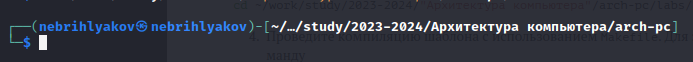

---
## Front matter
title: "Отчёт по лабораторной работе №3"
subtitle: "Дисциплина: архитектура компьютера"
author: "Брыляков Никита Евгеньевич"

## Generic otions
lang: ru-RU
toc-title: "Содержание"

## Bibliography
bibliography: bib/cite.bib
csl: pandoc/csl/gost-r-7-0-5-2008-numeric.csl

## Pdf output format
toc: true # Table of contents
toc-depth: 2
lof: true # List of figures
fontsize: 12pt
linestretch: 1.5
papersize: a4
documentclass: scrreprt
## I18n polyglossia
polyglossia-lang:
  name: russian
  options:
	- spelling=modern
	- babelshorthands=true
polyglossia-otherlangs:
  name: english
## I18n babel
babel-lang: russian
babel-otherlangs: english
## Fonts
mainfont: PT Serif
romanfont: PT Serif
sansfont: PT Sans
monofont: PT Mono
mainfontoptions: Ligatures=TeX
romanfontoptions: Ligatures=TeX
sansfontoptions: Ligatures=TeX,Scale=MatchLowercase
monofontoptions: Scale=MatchLowercase,Scale=0.9
## Biblatex
biblatex: true
biblio-style: "gost-numeric"
biblatexoptions:
  - parentracker=true
  - backend=biber
  - hyperref=auto
  - language=auto
  - autolang=other*
  - citestyle=gost-numeric
## Pandoc-crossref LaTeX customization
figureTitle: "Рис."
tableTitle: "Таблица"
listingTitle: "Листинг"
lofTitle: "Список иллюстраций"
lolTitle: "Листинги"
## Misc options
indent: true
header-includes:
  - \usepackage{indentfirst}
  - \usepackage{float} # keep figures where there are in the text
  - \floatplacement{figure}{H} # keep figures where there are in the text
---

# Цель работы

Целью данной лабораторной работы является освоение процедуры оформления отчетов с помощью легковесного языка разметки Markdown.

# Задание

1. Установка TexLife.
2. Установка pandoc.
3. Заполнение отчета по выполнению лабораторной работы №2 с помощью языка разметки Markdown.
4. Задание для самостоятельной работы
# Теоретическое введение

Markdown - легковесный язык разметки, созданный с целью обозначения форматирования в простом тексте, с максимальным сохранением его читаемости человеком, и пригодный для машинного преобразования в языки для продвинутых публикаций. 
Внутритекстовые формулы делаются аналогично формулам LaTeX.
В Markdown вставить изображение в документ можно с помощью непосредственного указания адреса изображения.
Синтаксис Markdown для встроенной ссылки состоит из части [link text], представляющей текст гиперссылки, и части (file-name.md) – URL-адреса или имени файла, на который дается ссылка.
Markdown поддерживает как встраивание фрагментов кода в предложение, так и их размещение между предложениями в виде отдельных огражденных блоков. Огражденные блоки кода — это простой способ выделить синтаксис для фрагментов кода.

# Выполнение лабораторной работы

## Установка TexLive

Скачиваю TexLive с сайта и распаковываю (рис. [-@fig:001])

{ #fig:001 width=70% }

Перехожу в распакованную папку с помощью cd. Запускаю скрипт install-tl-* с правами root (рис. [-@fig:002])

{ #fig:002 width=70% }

Добавляю /usr/local/texlive/2023/bin/x86_64-linux в свой PATH для текущей и будущих сессий (рис. [-@fig:003]).

{ #fig:003 width=70% }

## Установка pandoc и pandoc

Скачиваю pandoc (рис. [-@fig:004]). 

{ #fig:004 width=70% }

Скачиваю pandoc-crossref (рис. [-@fig:005]).

{ #fig:005 width=70% }

Распаковываю скачанное (рис. [-@fig:006]).

{ #fig:006 width=70% }

Копирую файлы в каталог /usr/local/bin/ (рис. [-@fig:007]).

{ #fig:007 width=70% }

## Заполнение отчета по выполнению лабораторной работы №2 с помощью языка разметки Markdown.

Открываю терминал и перехожу в каталог курса, сформированный при выполнении прошлой лабораторной работы. (рис. [-@fig:008]).

{ #fig:008 width=70% }

Обновляю локальный репозиторий, скачав изменения из удаленного репозитория с помощью команды git pull (рис. [-@fig:009]).

{ #fig:009 width=70% }

Перехожу в каталог с шаблоном отчета по лабораторной работе №3 (рис. [-@fig:010]).

{ #fig:010 width=70% }

Компилирую шаблон с использованием, вводя команду make (рис. [-@fig:011]).

{ #fig:011 width=70% }

Открываю сгенерированные файлы pdf и docx. Убеждаюсь, что все правильно сгенерировалось. (рис. [-@fig:012]).

{ #fig:012 width=70% }

Удаляю полученные файлы с использованием, вводя команду make clean. Убеждаюсь, что они удалились. (рис. [-@fig:013]).

{ #fig:013 width=70% }

Открываю файл report.md с помощью текстового редактора mousepad и начинаю работу (рис. [-@fig:014]).

{ #fig:014 width=70% }

Компилирую файл с отчётом и загружаю на ГитХаб.

# Выводы

В результате выполнения данной лабораторной работы я освоил процедуры оформления отчетов с помощью легковесного языка разметки Markdown.

# Список литературы

1. [Архитектура ЭВМ](https://esystem.rudn.ru/pluginfile.php/1584625/mod_resource/content/1/%D0%9B%D0%B0%D0%B1%D0%BE%D1%80%D0%B0%D1%82%D0%BE%D1%80%D0%BD%D0%B0%D1%8F%20%D1%80%D0%B0%D0%B1%D0%BE%D1%82%D0%B0%20%E2%84%964.pdf)
