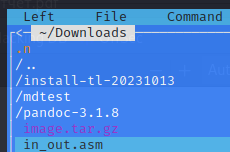

---
## Front matter
title: "Отчёт по лабораторной работе №5"
subtitle: "Архитектура компьютеров и операционные системы. "
author: "Брыляков Никита Евгеньевич"

## Generic otions
lang: ru-RU
toc-title: "Содержание"

## Bibliography
bibliography: bib/cite.bib
csl: pandoc/csl/gost-r-7-0-5-2008-numeric.csl

## Pdf output format
toc: true # Table of contents
toc-depth: 2
lof: true # List of figures
fontsize: 12pt
linestretch: 1.5
papersize: a4
documentclass: scrreprt
## I18n polyglossia
polyglossia-lang:
  name: russian
  options:
	- spelling=modern
	- babelshorthands=true
polyglossia-otherlangs:
  name: english
## I18n babel
babel-lang: russian
babel-otherlangs: english
## Fonts
mainfont: PT Serif
romanfont: PT Serif
sansfont: PT Sans
monofont: PT Mono
mainfontoptions: Ligatures=TeX
romanfontoptions: Ligatures=TeX
sansfontoptions: Ligatures=TeX,Scale=MatchLowercase
monofontoptions: Scale=MatchLowercase,Scale=0.9
## Biblatex
biblatex: true
biblio-style: "gost-numeric"
biblatexoptions:
  - parentracker=true
  - backend=biber
  - hyperref=auto
  - language=auto
  - autolang=other*
  - citestyle=gost-numeric
## Pandoc-crossref LaTeX customization
figureTitle: "Рис."
listingTitle: "Листинг"
lofTitle: "Список иллюстраций"
lolTitle: "Листинги"
## Misc options
indent: true
header-includes:
  - \usepackage{indentfirst}
  - \usepackage{float} # keep figures where there are in the text
  - \floatplacement{figure}{H} # keep figures where there are in the text
---

# Цель работы

Приобретение практических навыков работы в Midnight Commander. Освоение инструкций языка ассемблера mov и int.

# Задание

1. Начало работы
2. Подключение внешнего файла in_out.asm
3. Выполнение заданий для самостоятельной работы

# Теоретическое введение

Midnight Commander (или просто mc) — это программа, которая позволяет просматривать структуру каталогов и выполнять основные операции по управлению файловой системой, т.е. mc является файловым менеджером. Midnight Commander позволяет сделать работу с файлами более удобной и наглядной. Программа на языке ассемблера NASM, как правило, состоит из трёх секций: секция кода программы (SECTION .text), секция инициированных (известных во время компиляции) данных (SECTION .data) и секция неинициализированных данных (тех, под которые во время компиляции только отводится память, а значение присваивается в ходе выполнения программы) (SECTION .bss).
Для объявления инициированных данных в секции .data используются директивы DB, DW,
DD, DQ и DT, которые резервируют память и указывают, какие значения должны храниться в
этой памяти:
• DB (define byte) — определяет переменную размером в 1 байт;
• DW (define word) — определяет переменную размеров в 2 байта (слово);
• DD (define double word) — определяет переменную размером в 4 байта (двойное слово);
• DQ (define quad word) — определяет переменную размером в 8 байт (учетверённое слово);
• DT (define ten bytes) — определяет переменную размером в 10 байт
Инструкция языка ассемблера intпредназначена для вызова прерывания с указанным
номером. В общем виде она записывается в виде
int n
Здесь n — номер прерывания, принадлежащий диапазону 0–255.
При программировании в Linux с использованием вызовов ядра sys_calls n=80h (принято
задавать в шестнадцатеричной системе счисления).

# Выполнение лабораторной работы
## Начало работы

Открываю Midnight Commander (рис. [-@fig:001]).

{ #fig:001 width=70% }

Перехожу в каталог ~/work/arch-pc созданный при выполнении лабораторной работы №4  (рис. [-@fig:002]).

{ #fig:002 width=70% }

Создаю папку lab05 и перехожу в созданный каталог. (рис. [-@fig:003]).

{ #fig:003 width=70% }

Создаю файл lab5-1.asm(рис. [-@fig:004]).

{ #fig:004 width=70% }

Открываю файл lab5-1.asm для редактирования во встроенном редакторе (рис. [-@fig:005]).

{ #fig:005 width=70% }

Ввожу текст программы и сохраняю (рис. [-@fig:006]).

{ #fig:006 width=70% }

Открываю файл lab5-1.asm для просмотра и убеждаюсь в наличии текста.(рис. [-@fig:007]).

{ #fig:007 width=70% }

Оттранслирую текст программы lab5-1.asm в объектный файл. Выполняю компоновку объектного файла и запускаю получившийся исполняемый файл. Программа выводит строку 'Введите строку:' и ожидает ввода с клавиатуры. На запрос ввожу своё ФИО (рис. [-@fig:008]).

{ #fig:008 width=70% }

## Подключение внешнего файла in_out.asm

Скачиваю файл in_out.asm со страницы курса в ТУИС (рис. [-@fig:009]). 

{ #fig:009 width=70% }

Копирую файл in_out.asm из каталога Downloads в каталог lab05 (рис. [-@fig:010]).

{ #fig:010 width=70% }

Создаю копию файла lab5-1.asm с именем lab5-2.asm (рис. [-@fig:011]).

{ #fig:011 width=70% }

Изменяю содержимое файла lab-2.asm (рис. [-@fig:012]).

{ #fig:012 width=70% }

Создаю исполняемый файл и проверяю его работу. (рис. [-@fig:013]).

{ #fig:013 width=70% }

Открываю файл lab5-2.asm. Изменяю в нем подпрограмму sprintLF на sprint. (рис. [-@fig:014]).

{ #fig:014 width=70% }

Создаю исполняемый файл и проверяю его работу. (рис. [-@fig:015]).

{ #fig:015 width=70% }

Разница в том, что в случае с подпрограммой sprintLF исполняемый файл запрашивает ввод с новой строки, а с подпрогарммой sprint запрашивает ввод без переноса на новую строку

## Выполнение заданий для самостоятельной работы

Создаю копию файла lab5-1.asm, называю её lab5-11.asm. (рис. [-@fig:016]).

{ #fig:016 width=70% }

Открываю программу и редактирую по заданию. (рис. [-@fig:017]).

{ #fig:017 width=70% }

Получаю исполняемый файл и проверяю его работу. (рис. [-@fig:018]).

{ #fig:018 width=70% }

Создаю копию файла lab5-2.asm, называю её lab5-22.asm. (рис. [-@fig:019]).

{ #fig:019 width=70% }

Открываю программу и редактирую по заданию. (рис. [-@fig:020]).

{ #fig:20 width=70% }

Получаю исполняемый файл и проверяю его работу. (рис. [-@fig:21]).

{ #fig:21 width=70% }

# Вывод

При выполнении данной лабораторной работы я приобрёл практические навыки работы в Midnight Commander. Освоил инструкции языка ассемблера mov и int.

# Список литературы

1. https://esystem.rudn.ru/pluginfile.php/2089085/mod_resource/content/0/%D0%9B%D0%B0%D0%B1%D0%BE%D1%80%D0%B0%D1%82%D0%BE%D1%80%D0%BD%D0%B0%D1%8F%20%D1%80%D0%B0%D0%B1%D0%BE%D1%82%D0%B0%20%E2%84%965.%20%D0%9E%D1%81%D0%BD%D0%BE%D0%B2%D1%8B%20%D1%80%D0%B0%D0%B1%D0%BE%D1%82%D1%8B%20%D1%81%20Midnight%20Commander%20%28%29.%20%D0%A1%D1%82%D1%80%D1%83%D0%BA%D1%82%D1%83%D1%80%D0%B0%20%D0%BF%D1%80%D0%BE%D0%B3%D1%80%D0%B0%D0%BC%D0%BC%D1%8B%20%D0%BD%D0%B0%20%D1%8F%D0%B7%D1%8B%D0%BA%D0%B5%20%D0%B0%D1%81%D1%81%D0%B5%D0%BC%D0%B1%D0%BB%D0%B5%D1%80%D0%B0%20NASM.%20%D0%A1%D0%B8%D1%81%D1%82%D0%B5%D0%BC%D0%BD%D1%8B%D0%B5%20%D0%B2%D1%8B%D0%B7%D0%BE%D0%B2%D1%8B%20%D0%B2%20%D0%9E%D0%A1%20GNU%20Linux.pdf

