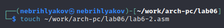
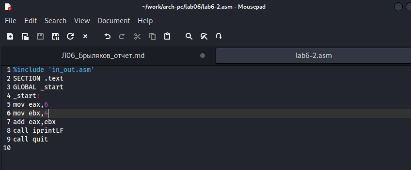
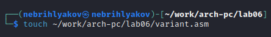

---
## Front matter
title: "Отчёт по лабораторной работе №6"
subtitle: "Архитектура компьютеров и операционные системы. "
author: "Брыляков Никита Евгеньевич"

## Generic otions
lang: ru-RU
toc-title: "Содержание"

## Bibliography
bibliography: bib/cite.bib
csl: pandoc/csl/gost-r-7-0-5-2008-numeric.csl

## Pdf output format
toc: true # Table of contents
toc-depth: 2
lof: true # List of figures
fontsize: 12pt
linestretch: 1.5
papersize: a4
documentclass: scrreprt
## I18n polyglossia
polyglossia-lang:
  name: russian
  options:
	- spelling=modern
	- babelshorthands=true
polyglossia-otherlangs:
  name: english
## I18n babel
babel-lang: russian
babel-otherlangs: english
## Fonts
mainfont: PT Serif
romanfont: PT Serif
sansfont: PT Sans
monofont: PT Mono
mainfontoptions: Ligatures=TeX
romanfontoptions: Ligatures=TeX
sansfontoptions: Ligatures=TeX,Scale=MatchLowercase
monofontoptions: Scale=MatchLowercase,Scale=0.9
## Biblatex
biblatex: true
biblio-style: "gost-numeric"
biblatexoptions:
  - parentracker=true
  - backend=biber
  - hyperref=auto
  - language=auto
  - autolang=other*
  - citestyle=gost-numeric
## Pandoc-crossref LaTeX customization
figureTitle: "Рис."
listingTitle: "Листинг"
lofTitle: "Список иллюстраций"
lolTitle: "Листинги"
## Misc options
indent: true
header-includes:
  - \usepackage{indentfirst}
  - \usepackage{float} # keep figures where there are in the text
  - \floatplacement{figure}{H} # keep figures where there are in the text
---

# Цель работы

Освоение арифметических инструкций языка ассемблера NASM.

# Задание

1. Символьные и численные данные в NASM
2. Выполнение арифметических операций в NASM
3. Выполнение заданий для самостоятельной работы

# Теоретическое введение

Большинство инструкций на языке ассемблера требуют обработки операндов. Адрес опе-
ранда предоставляет место, где хранятся данные, подлежащие обработке. Это могут быть
данные хранящиеся в регистре или в ячейке памяти. Далее рассмотрены все существующие
способы задания адреса хранения операндов – способы адресации.
Существует три основных способа адресации:
• Регистровая адресация – операнды хранятся в регистрах и в команде используются
имена этих регистров, например: mov ax,bx.
• Непосредственная адресация – значение операнда задается непосредственно в ко-
манде, Например: mov ax,2.
• Адресация памяти – операнд задает адрес в памяти. В команде указывается символи-
ческое обозначение ячейки памяти, над содержимым которой требуется выполнить
операцию.Ввод информации с клавиатуры и вывод её на экран осуществляется в символьном виде.
Кодирование этой информации производится согласно кодовой таблице символов ASCII.
ASCII – сокращение от American Standard Code for Information Interchange (Американский
стандартный код для обмена информацией). Согласно стандарту ASCII каждый символ
кодируется одним байтом.
Расширенная таблица ASCII состоит из двух частей. Первая (символы с кодами 0-127)
является универсальной (см. Приложение.), а вторая (коды 128-255) предназначена для
специальных символов и букв национальных алфавитов и на компьютерах разных типов
может меняться.
Среди инструкций NASM нет такой, которая выводит числа (не в символьном виде). По-
этому, например, чтобы вывести число, надо предварительно преобразовать его цифры в
ASCII-коды этих цифр и выводить на экран эти коды, а не само число. Если же выводить число
на экран непосредственно, то экран воспримет его не как число, а как последовательность
ASCII-символов – каждый байт числа будет воспринят как один ASCII-символ – и выведет на
экран эти символы.
Аналогичная ситуация происходит и при вводе данных с клавиатуры. Введенные дан-
ные будут представлять собой символы, что сделает невозможным получение корректного
результата при выполнении над ними арифметических операций.

# Выполнение лабораторной работы
## Начало работы

Создаю каталог для работы, перехожу в него и создаю файл lab6-1.asm (рис. [-@fig:001]).

{ #fig:001 width=70% }

Вручную переношу файл in_out.asm и проверяю его наличие в каталоге (рис. [-@fig:002]).

{ #fig:002 width=70% }

Открываю файл lab6-1.asm и ввожу нужную программу (рис. [-@fig:003]).

{ #fig:003 width=70% }

Создаю исполняемый файл и запускаю его (рис. [-@fig:004]).

{ #fig:004 width=70% }

Заменяю некоторые строки в программе (рис. [-@fig:005]).

{ #fig:005 width=70% }

Создаю новый исполняемый файл и запускаю его. Код 10 соответствует символу переноса строки. Он не выводится на экран(рис. [-@fig:006]).

{ #fig:006 width=70% }

Создаю новый файл в каталоге (рис. [-@fig:007]).

{ #fig:007 width=70% }

Ввожу в него текст программы (рис. [-@fig:008]).

{ #fig:008 width=70% }

Создаю исполняемый файл и запускаю его. В данном случае программа производит сложение кодов символов и выводит число, а не символ, кодом которого является это число (рис. [-@fig:009]). 

{ #fig:009 width=70% }

Заменяю некоторые строки в программе (рис. [-@fig:010]).

{ #fig:010 width=70% }

Создаю новый исполняемый файл и запускаю его. Теперь программа складывает сами числа (рис. [-@fig:011]).

{ #fig:011 width=70% }

Заменяю функцию iprintLF на iprint (рис. [-@fig:012]).

{ #fig:012 width=70% }

Создаю исполняемый файл и запускаю его. Вывод не изменился. С iprintLF символ перевода строки не отображался, а iprint, в отличие от iprintLF, не производит перевод строки (рис. [-@fig:013]).

{ #fig:013 width=70% }

## Выполнение арифметических операций в NASM

Создаю новый файл в каталоге (рис. [-@fig:014]).

{ #fig:014 width=70% }

Ввожу в него текст программы. (рис. [-@fig:015]).

{ #fig:015 width=70% }

Создаю исполняемый файл и запускаю его (рис. [-@fig:016]).

{ #fig:016 width=70% }

Изменяю текст программы для вычисления выражения f(x) = (4 * 6 + 2)/5.  (рис. [-@fig:017]).

{ #fig:017 width=70% }

Создаю новый исполняемый файл и запускаю его. Всё верно (рис. [-@fig:018]).

{ #fig:018 width=70% }

Создаю файл variant.asm в каталоге (рис. [-@fig:019]).

{ #fig:019 width=70% }

Ввожу в него текст программы для вычисления варианта. (рис. [-@fig:020]).

{ #fig:020 width=70% }

Создаю исполняемый файл и запускаю его. Мой вариант - 5. (рис. [-@fig:021]).

{ #fig:21 width=70% }

### Ответы на вопросы

1. За вывод на экран сообщения ‘Ваш вариант:’ отвечают строки "mov eax,rem" и "call sprint"
2. Инструкция "mov ecx, x" чтобы положить адрес строки, которая вводится, в регистр. "mov edx, 80" в регистр запись длины вводимой строки. "call sread" вывод подпрограммы, которая обеспечивает ввод с клавиатуры.
3. "call atoi" используется для вывода подпрограммы, которая производит преобразование ascii кода символа в целое число и записывает результат в регистр eax.
4. За вычисление варианта отвечают эти строки: "xor edx, edx", "mov ebx, 20", "div ebx", "inc edx"
5. При выполнении инструкции “div ebx” остаток от деления записывается в регистр edx.
6. Инструкция “inc edx” увеличивает значение регистра edx на 1.
7. За вывод на экран результата вычислений отвечают эти строки: "mov eax, edx", "call iprintLF".

## Выполнение заданий для самостоятельной работы

Создаю файл lab6-4.asm в каталоге (рис. [-@fig:022]).

{ #fig:022 width=70% }

Ввожу в него текст программы для вычисления значения выражения моего варианта (9x - 8)/8. (рис. [-@fig:023]).

{ #fig:23 width=70% }

Создаю исполняемый файл и запускаю его. Проверяю его для двух значениев x: 8 и 64. Я также проверил вручную и результаты оказались верны. (рис. [-@fig:024]).

{ #fig:24 width=70% }

# Вывод

При выполнении данной лабораторной работы я освоил арифметические инструкции языка ассемблера NASM.

# Список литературы

1. https://esystem.rudn.ru/pluginfile.php/2089086/mod_resource/content/0/%D0%9B%D0%B0%D0%B1%D0%BE%D1%80%D0%B0%D1%82%D0%BE%D1%80%D0%BD%D0%B0%D1%8F%20%D1%80%D0%B0%D0%B1%D0%BE%D1%82%D0%B0%20%E2%84%966.%20%D0%90%D1%80%D0%B8%D1%84%D0%BC%D0%B5%D1%82%D0%B8%D1%87%D0%B5%D1%81%D0%BA%D0%B8%D0%B5%20%D0%BE%D0%BF%D0%B5%D1%80%D0%B0%D1%86%D0%B8%D0%B8%20%D0%B2%20NASM..pdf

