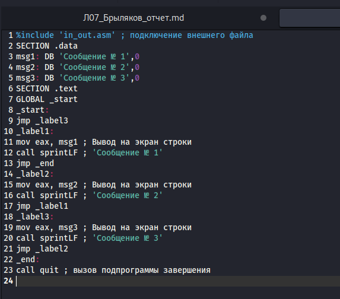
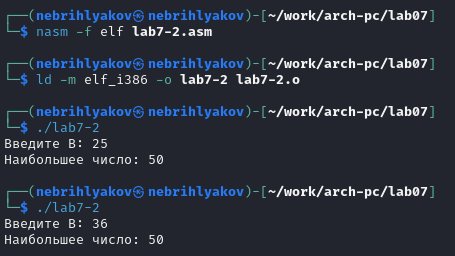
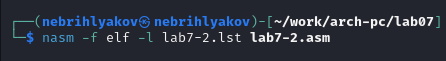
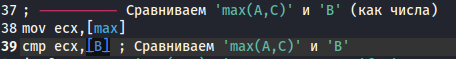

---
## Front matter
title: "Отчёт по лабораторной работе №7"
subtitle: "Архитектура компьютеров и операционные системы. "
author: "Брыляков Никита Евгеньевич"

## Generic otions
lang: ru-RU
toc-title: "Содержание"

## Bibliography
bibliography: bib/cite.bib
csl: pandoc/csl/gost-r-7-0-5-2008-numeric.csl

## Pdf output format
toc: true # Table of contents
toc-depth: 2
lof: true # List of figures
fontsize: 12pt
linestretch: 1.5
papersize: a4
documentclass: scrreprt
## I18n polyglossia
polyglossia-lang:
  name: russian
  options:
	- spelling=modern
	- babelshorthands=true
polyglossia-otherlangs:
  name: english
## I18n babel
babel-lang: russian
babel-otherlangs: english
## Fonts
mainfont: PT Serif
romanfont: PT Serif
sansfont: PT Sans
monofont: PT Mono
mainfontoptions: Ligatures=TeX
romanfontoptions: Ligatures=TeX
sansfontoptions: Ligatures=TeX,Scale=MatchLowercase
monofontoptions: Scale=MatchLowercase,Scale=0.9
## Biblatex
biblatex: true
biblio-style: "gost-numeric"
biblatexoptions:
  - parentracker=true
  - backend=biber
  - hyperref=auto
  - language=auto
  - autolang=other*
  - citestyle=gost-numeric
## Pandoc-crossref LaTeX customization
figureTitle: "Рис."
listingTitle: "Листинг"
lofTitle: "Список иллюстраций"
lolTitle: "Листинги"
## Misc options
indent: true
header-includes:
  - \usepackage{indentfirst}
  - \usepackage{float} # keep figures where there are in the text
  - \floatplacement{figure}{H} # keep figures where there are in the text
---

# Цель работы

Изучение команд условного и безусловного переходов. Приобретение навыков написания
программ с использованием переходов. Знакомство с назначением и структурой файла
листинга.

# Задание

1. Реализация переходов в NASM
2. Изучение структуры файлы листинга
3. Выполнение заданий для самостоятельной работы

# Теоретическое введение

Для реализации ветвлений в ассемблере используются так называемые команды передачи
управления или команды перехода. Можно выделить 2 типа переходов:
• условный переход – выполнение или не выполнение перехода в определенную точку
программы в зависимости от проверки условия.
• безусловный переход – выполнение передачи управления в определенную точку про-
граммы без каких-либо условий. Безусловный переход выполняется инструкцией jmp. Адрес перехода может быть либо меткой, либо адресом области памяти, в которую предва-
рительно помещен указатель перехода. Кроме того, в качестве операнда можно использовать
имя регистра, в таком случае переход будет осуществляться по адресу, хранящемуся в этом
регистре. Как отмечалось выше, для условного перехода необходима проверка какого-либо условия.
В ассемблере команды условного перехода вычисляют условие перехода анализируя флаги
из регистра флагов. Листинг (в рамках понятийного аппарата NASM) — это один из выходных файлов, созда-
ваемых транслятором. Он имеет текстовый вид и нужен при отладке программы, так как
кроме строк самой программы он содержит дополнительную информацию.

# Выполнение лабораторной работы
## Реализация переходов в NASM

Создаю каталог для программ лабораторной работы № 7, перехожу в него и создаю файл lab7-1.asm (рис. [-@fig:001]).

{ #fig:001 width=70% }

Ввожу в файл lab7-1.asm текст программы из листинга 7.1. (рис. [-@fig:002]).

{ #fig:002 width=70% }

Создаю исполняемый файл и запускаю его. (рис. [-@fig:003]).

{ #fig:003 width=70% }

Изменяю текст программы в соответствии с листингом 7.2. (рис. [-@fig:004]).

{ #fig:004 width=70% }

Создаю исполняемый файл и запускаю его. (рис. [-@fig:005]).

{ #fig:005 width=70% }

Редактирую программу так, чтобы вывод был как по заданию (рис. [-@fig:006]).

{ #fig:006 width=70% }

Создаю исполняемый файл и запускаю его. (рис. [-@fig:007]).

{ #fig:007 width=70% }

Создаю файл lab7-2.asm в каталоге ~/work/arch-pc/lab07. (рис. [-@fig:008]).

{ #fig:008 width=70% }

Изучаю текст программы из листинга 7.3 и ввожу в lab7-2.asm. (рис. [-@fig:009]). 

{ #fig:009 width=70% }

Создаю исполняемый файл и проверяю его работу для некоторых значений B. Программа работает корректно. (рис. [-@fig:010]).

{ #fig:010 width=70% }

## Изучение структуры файлы листинга

Создаю файл листинга для программы из файла lab7-2.asm (рис. [-@fig:011]).

{ #fig:011 width=70% }

Открываю файл листинга lab7-2.lst с помощью текстового редактора mousepad и ознакамливаюсб с его содержимым. (рис. [-@fig:012]).

{ #fig:012 width=70% }

Объясню эти три строчки: "60" - номер строки кода, "; входные данные: mov eax,<buffer>, mov ebx,<N>" - комментарий, "61" - номер строки кода, "sread:" - считывающая строку функция, "62" - номер строки кода, "00000043" - адрес строки, "push ebx" - текст самой программы (помещает значение регистра 'EBX' в стек. (рис. [-@fig:013]).

{ #fig:013 width=70% }

Открываю файл с программой lab7-2.asm и в инструкции с двумя операндами удаляю операнд B (рис. [-@fig:014]).

{ #fig:014 width=70% }

Выполняю трансляцию с получением файла листинга (рис. [-@fig:015]).

{ #fig:015 width=70% }

На выходе я не получаю ничего, так как инструкция не срабатывает из-за наличия только одного операнда.

## Выполнение заданий для самостоятельной работы

Пишу программу в файле lab7-3.asm нахождения наименьшей из 3 целочисленных переменных a, b и c. Значения переменных выбираю из табл. 7.5 в соответствии с вариантом, полученным при выполнении предыдущей лабораторной работы. Мой вариант был 5 так что мои числа это 54, 62, 87. (рис. [-@fig:016]).

{ #fig:016 width=70% }

Создаю исполняемый файл и проверяю его работу. Всё верно. (рис. [-@fig:017]).

{ #fig:017 width=70% }

# Вывод

При выполнении данной лабораторной работы я изучил команды условного и безусловного переходов. Приобрёл навыки написания программ с использованием переходов. Познакомился с назначением и структурой файла листинга.

# Список литературы

1. https://esystem.rudn.ru/pluginfile.php/2089087/mod_resource/content/0/%D0%9B%D0%B0%D0%B1%D0%BE%D1%80%D0%B0%D1%82%D0%BE%D1%80%D0%BD%D0%B0%D1%8F%20%D1%80%D0%B0%D0%B1%D0%BE%D1%82%D0%B0%20%E2%84%967.%20%D0%9A%D0%BE%D0%BC%D0%B0%D0%BD%D0%B4%D1%8B%20%D0%B1%D0%B5%D0%B7%D1%83%D1%81%D0%BB%D0%BE%D0%B2%D0%BD%D0%BE%D0%B3%D0%BE%20%D0%B8%20%D1%83%D1%81%D0%BB%D0%BE%D0%B2%D0%BD%D0%BE%D0%B3%D0%BE%20%D0%BF%D0%B5%D1%80%D0%B5%D1%85%D0%BE%D0%B4%D0%BE%D0%B2%20%D0%B2%20Nasm.%20%D0%9F%D1%80%D0%BE%D0%B3%D1%80%D0%B0%D0%BC%D0%BC%D0%B8%D1%80%D0%BE%D0%B2%D0%B0%D0%BD%D0%B8%D0%B5%20%D0%B2%D0%B5%D1%82%D0%B2%D0%BB%D0%B5%D0%BD%D0%B8%D0%B9..pdf

